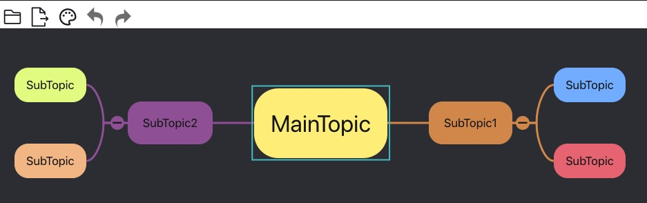

This is a online mindmap app using [blink-mind](https://github.com/awehook/blink-mind) library.

### Online Demo

[Demo](https://awehook.github.io/react-mindmap/)

[Example mind map](https://github.com/awehook/mindmap) You can download example mind maps from the repository: https://github.com/awehook/mindmap and use this app open the mind map file.


### Features

* Markdown editor for topic and topic notes.


* flowchart can be attached to topic.


* HotKey support.


* Reorganize the diagram by drag and drop.


* Multiple theme. 


* Style customization.


### How to run
```
yarn install
yarn start
```

Then open [localhost:3000](http://localhost:3000)




